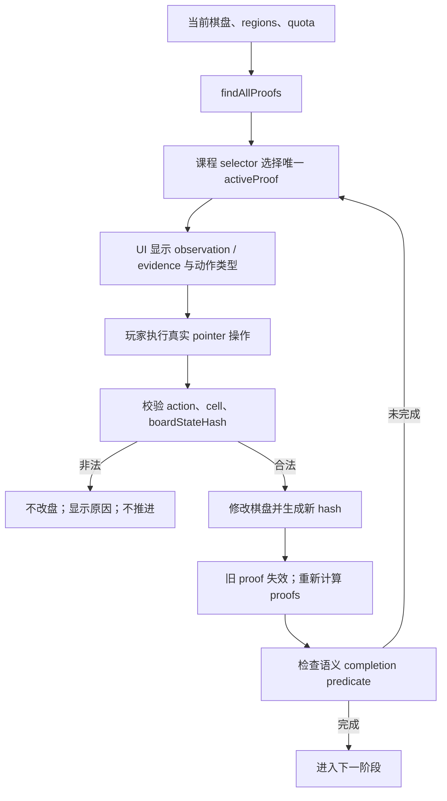

# Star Double Lv.1–10 证明驱动教学规范

## 产品目标

Lv.1–10 是一条可实际游玩、理解、完成和验证的课程。每关都要让玩家知道学什么、
观察哪里、应该标 X 还是放置星星，并亲手完成 Guided、Transfer Practice 和整关。

Lv.1 继续引用已经验收的原合同。Lv.2–9 的教学结论只来自当前棋盘、星域与双星配额；
Lv.10 不增加规则，只保留需要玩家确认的 INTRO 与 Autonomous。

## 逐关决策

| Lv | 主题 | 数据决策 | 合同决策 | 正式入口 |
|---:|---|---|---|---:|
| 1 | 双星规则与 2×2 入门 | KEEP_LAYOUT_AND_CONTRACT | 引用原合同 | 原流程 |
| 2 | 星星周围八格排除 | REGENERATE_LEVEL | proof-driven 重写 | 1 步 |
| 3 | 单位已有两星后的排除 | REGENERATE_LEVEL | proof-driven 重写 | 2 步 |
| 4 | 剩余合法格等于缺星数 | REGENERATE_LEVEL | proof-driven 重写 | 1 步 |
| 5 | 已有一星后寻找第二颗 | REGENERATE_LEVEL | strategy contract 重写 | 1 步 |
| 6 | 星域形状与局部容量 | KEEP_LAYOUT_REWRITE_CONTRACT | 新增 confined proof | 2 步 |
| 7 | 多单位交叉判断 | REGENERATE_LEVEL | 新增 intersection proof | 1 步 |
| 8 | 两依据位置的共同冲突 | KEEP_LAYOUT_REWRITE_CONTRACT | 新增 common-conflict proof | 1 步 |
| 9 | 三步传播链 | REGENERATE_LEVEL | 带前瞻的 strategy contract | 0 步 |
| 10 | 毕业挑战 | KEEP_LAYOUT_REWRITE_CONTRACT | INTRO → Autonomous | 手动确认 |

稳定 level ID、8×8 尺寸、课程顺序和进度映射不变。Lv.11–60 完全不在本课程数据
修改范围内。

## 证明与状态流



任何 proof 都必须有非空 `derivedTargets`、当前 `boardStateHash`、可独立重算的
`premises`、`observationCells` 与 `evidenceCells`。引擎不读取 `solution`、
`revealPath` 或 `canonicalPath`。

正式通用技术：

- `two-by-two-capacity`
- `adjacency-exclusion`
- `quota-saturated`
- `remaining-capacity`
- `confined-capacity`
- `multi-unit-intersection`
- `common-conflict`

Lv.9 不是第八种规则。Chain 1 和 Chain 2 只选择能在操作后新生成下一条证明的目标；
Chain 2/3 还必须与前一步受影响单位重叠，且证明 identity 在前一步操作前不存在。

## 合同与界面边界

Lv.2–9 的互动步骤使用统一 schema：`id`、`phase`、`lessonTopic`、
`proofSelector`、`allowedPrerequisiteRules`、`completionPredicate`、
`expectedAction`、观察/依据呈现、隐藏目标、错误反馈与转换条件。

- SETUP 必须由真实玩家操作和盘面条件共同完成，不能按固定动作次数跳过。
- Guided 显示观察范围与依据，不显示目标。
- Transfer Practice 更换 proof 或单位，不显示目标，但继续明确动作类型。
- proof 缺失、目标为空或哈希陈旧时禁止输入。
- Autonomous 不使用 proof bridge；基础提示延迟机制保持独立。
- Summary 只在棋盘完成后记录课程完成，不改变正式进度 schema。

放置星星使用正式双击语义：第一次 tap 进入待定，窗口内第二次 tap 取消待定 X，
最终只提交一次 `place-star`。测试也使用两次 pointer tap，不使用裸 `dblclick`。

## E2E bridge

仅当 `VITE_E2E_PROOF_BRIDGE=1` 时可用。对象及三个数组均冻结，只允许：

`levelId`、`lessonStepId`、`lessonStep`、`phase`、`technique`、
`expectedAction`、`observationCells`、`evidenceCells`、`derivedTargets`、
`boardStateHash`。

bridge 没有 setter、答案或 canonical path；production build 中属性不存在。UI、
bridge 和输入校验都读取同一个 `activeProof`。

## 生成与质量门禁

生成器 `scripts/generate-star-double-teaching-course.mjs` 使用固定 seed：

- 单关最多 4,000 attempts。
- 单关 wall-clock 最多 10 分钟。
- 每个有效候选即时 checkpoint，支持 `--resume`。
- 只接受第一个完整通过课程模拟的候选。
- 候选从不同正式 8×8 母版收缩星域，保留多样推理结构。

每个候选必须通过连通、声明解合法、唯一解、人类逻辑、trace 回放、截至该课的规则
白名单、exact/D4 region、normalized reasoning fingerprint、exact trace、相邻
region ≤ 0.50、相邻 trace ≤ 0.78、教学 trace < 0.95 和完整课程模拟。

最终主题入口动作数为：

`Lv.2=1, Lv.3=2, Lv.4=1, Lv.5=1, Lv.6=2, Lv.7=1, Lv.8=1`。

Lv.9 的三步 board hash 在固定模拟中为不同值；E2E 还会重新确认三次真实 UI 操作后
才进入 Autonomous。

## 人工验收

1. 如只需重新看教学，在设置中选择已完成的 Lv.1–10 课程并点击”重新查看所选课程”。
2. 如需清除教学记录，在控制台执行：
   `localStorage.removeItem('cg_star_line_double_guidance_v1')`
3. 从 Lv.1 开始依次进入 Lv.10；不要清除 `cg_star_line_progress_v2`。
4. 每关确认主题、观察依据、动作说明、非法操作反馈、Transfer 不泄露目标和最终胜利。
5. Lv.9 特别确认每步完成后观察范围与动作类型都发生真实变化。
6. Lv.10 等待数秒确认 INTRO 不会自动跳过，再点击”开始挑战”独立完成。

## 课程类型

Lv.1–10 的每节课使用以下三种课程类型之一：

| 类型 | 含义 | 使用课程 |
| --- | --- | --- |
| `RULE` | 教授一条此前未出现的新规则。玩家需理解该规则的存在和触发条件。 | Lv.2（八邻格排除）、Lv.3（配额已满）、Lv.4（剩余容量） |
| `EQUIVALENT_CONCEPT` | 用新棋盘或不同单位重新演示已学规则，强化识别和迁移能力。 | Lv.5（已有一星后寻找第二颗）、Lv.6（星域形状与局部容量）、Lv.8（两位置共同冲突） |
| `STRATEGY` | 组合多条已学规则，完成多步传播链。新规则本身不需教学，重点是链式推理。 | Lv.7（多单位交叉）、Lv.9（三步传播链） |

Lv.1 为规则入门（引用原合同），Lv.10 为综合毕业，不归入以上三类。

## 状态机

### Lv.1–9 完整状态流

```
INTRO → SETUP → GUIDED → TRANSFER_PRACTICE → AUTONOMOUS → SUMMARY
```

| 阶段 | 触发条件 | 玩家行为 | 教学行为 |
| --- | --- | --- | --- |
| INTRO | 进入课程 | 阅读主题和教学目标、手动确认 | 展示本课主题、规则说明 |
| SETUP | 玩家确认 INTRO | 执行一次真实操作使盘面满足 proof 条件 | 等待特定盘面状态出现；不可用固定动作次数跳过 |
| GUIDED | proof 条件满足 | 按观察范围和依据执行动作（eliminate 或 place-star） | 高亮 observationCells 与 evidenceCells；明确动作类型；不高亮 derivedTargets |
| TRANSFER_PRACTICE | Guided 完成 | 在新的单位或 proof 上独立执行同类动作 | 更换 proof 或目标单位；保留观察范围与动作类型说明；不显示目标 |
| AUTONOMOUS | 所有教学步骤完成 | 完全自主完成剩余棋盘 | 不使用 proof bridge；仅提供基础提示延迟 |
| SUMMARY | 棋盘完成（isComplete） | 查看完成确认 | 记录 completedLessons |
```

### Lv.10 简化状态流

```
INTRO → AUTONOMOUS → SUMMARY
```

Lv.10 不增加新规则，不设置 SETUP/GUIDED/TRANSFER_PRACTICE 阶段。
INTRO 等待玩家手动确认（点击”开始挑战”），不会自动跳过。
确认后直接进入 AUTONOMOUS 阶段，由玩家完全自主完成整关。

## 存储与进度

### 教学完成存储

key: `cg_star_line_double_guidance_v1`

v5 正式结构：

```json
{
  “version”: 5,
  “completedLessons”: {
    “star-double-tutorial-01”: true,
    “star-double-tutorial-02”: true
  },
  “replayLevelId”: null
}
```

### v4 兼容

- v4 结构（`version: 4`）只兼容读取。
- v4 的 `replayRequested=true` 等价于 v5 的 `replayLevelId` 指向 Lv.1。
- v4 的旧 `completed` 数组只映射 Lv.1 的完成状态。
- 从 v4 读取后立即写入 v5 格式，不保留 v4 结构。
- 不自动完成 Lv.2–10：旧玩家升级后需从 Lv.2 开始依次完成教学。

### 中途状态不持久化

- 当前课程的 step 不写入 localStorage。
- 刷新页面后从当前课程的 INTRO 重新开始。
- 只有棋盘完成（isComplete、规则满足）后才写入 `completedLessons`。

### 指定课程重播

- 玩家在设置中选择已完成的 Lv.1–10 课程并点击”重新查看所选课程”。
- 设置 `replayLevelId` 为目标 levelId。
- 下次进入该课程时强制从 INTRO 开始，不使用已完成的跳过逻辑。
- 重播完成（SUMMARY）后清除 `replayLevelId`。
- 重播期间不修改正式进度 `cg_star_line_progress_v2`。

### 正式进度隔离

- 正式双星进度仍使用 `cg_star_line_progress_v2`，schema 未修改。
- 教学完成状态与正式进度是两个完全独立的存储 key。
- 教学关（Lv.1–10）的解锁由正式进度控制，教学的 completedLessons 只决定是否跳过 INTRO。

## 连续切关 Runtime 隔离

### Lv.5、Lv.7 问题

在连续快速切换关卡时（如一局结束后立即进入下一关），曾出现教学不触发的 bug。
根因是前一个关卡的 lesson runtime 状态（activeProof、step 索引、boardStateHash）
在切关时未完全清理，残留状态污染了新关卡的初始化流程。

### 修复原则

1. **切关时必须完全销毁旧 runtime。** 每次进入课程时从 INTRO 重新初始化，
   不继承任何前一个关卡的 proof、step 或 hash。
2. **boardStateHash 必须与当前棋盘严格对应。** 不允许旧 hash 在新棋盘上通过校验。
3. **proof engine 的 findAllProofs 必须在每次棋盘变化后完整重算。**
   不使用缓存或增量更新。
4. **Curriculum E2E 必须验证连续切关场景。** Lv.5 和 Lv.7 的定向测试
   （`e2e/star-double-lessons-5-7.spec.js`）覆盖了”完成前一关 → 进入目标关 →
   教学正常触发”的完整流程。

## Proof Engine 技术完整清单

当前 proof engine 支持 7 类证明技术。所有技术只读取当前棋盘、regions、quota 和
游戏规则，不使用 solution 或 canonicalPath。

| 技术标识 | 说明 | 首次教学 |
| --- | --- | --- |
| `two-by-two-capacity` | 2×2 子格至多一星，结合可复核 block cover 产生排除 | Lv.1 |
| `adjacency-exclusion` | 已有星点的八邻域全部排除 | Lv.2 |
| `quota-saturated` | 单位（行/列/星域）达到 2 星后排除其余所有格 | Lv.3 |
| `remaining-capacity` | 单位剩余候选格数等于仍需放置的星数时，全部置星 | Lv.4 |
| `confined-capacity` | source 候选完全受限于 target，且配额相等，产生排除 | Lv.6 |
| `multi-unit-intersection` | 两个同类 source 的全部候选被两个 target 包含，配额和严格相等 | Lv.7 |
| `common-conflict` | 两个位置必有一星时的共同冲突格排除 | Lv.8 |

Lv.9 不是第八种规则，而是上述技术的多步组合传播：Chain 1/2/3 的每一步各选择一条
能触发下一步证明的目标，后一步与前一步的受影响单位必须重叠，且证明 identity 在
前一步操作前不存在。

## Proof 与 boardStateHash 生命周期

1. `findAllProofs(board, regions, quota)` 对所有可能的目标产生全部合法证明。
2. 课程的 `proofSelector` 从所有证明中选择唯一 `activeProof`。
3. `activeProof` 包含 `boardStateHash`；棋盘任何变化后旧 hash 立即失效。
4. 以下情况禁止玩家输入：
   - `activeProof` 为 null 或 undefined
   - `derivedTargets` 为空
   - `boardStateHash` 与当前棋盘不匹配（stale proof）
5. UI、高亮系统、输入校验和 E2E bridge 都读取同一个 `activeProof` 实例。
6. 玩家执行合法操作 → 棋盘修改 → 新 hash → 旧 proof 失效 → `findAllProofs` 重新计算 → 新 proof 被 selector 选中。

## 后续新增教学课验收模板

新增一节教学课（如 Lv.11 以后的教学扩展）时，必须通过以下全部检查：

### 合同验证
- [ ] lesson contract 文件中有完整的 `id`、`lessonTopic`、`courseType` 和所有 step
- [ ] 每个 step 的 `proofSelector` 在目标盘面状态上返回非空 proof
- [ ] `completionPredicate` 在完成操作后正确触发
- [ ] 无 `actionCells`、`canonicalPath`、`solution`、`fixedCells` 等静态坐标

### 状态流验证
- [ ] `scripts/simulate-teaching-lesson.mjs` 对目标课程模拟通过
- [ ] SETUP 不被固定动作次数跳过，必须由真实盘面条件触发
- [ ] Guided 与 Transfer 具有不同的 proof 或不同的 target 单位
- [ ] 非法操作（错误 cell、错误 action、错误时机）不改盘、不推进
- [ ] 棋盘完成前 SUMMARY 不会提前触发

### E2E 验证
- [ ] 新增一条 curriculum E2E，使用真实 pointer 操作完成全部阶段
- [ ] 不使用 solution 推进课程
- [ ] 不直接写棋盘状态或 localStorage
- [ ] 不使用静态答案坐标
- [ ] 包含至少一次非法操作被拒绝的断言
- [ ] 如果课程涉及连续关卡，验证切关后 runtime 隔离

### 质量门禁
- [ ] 关卡通过 solver 唯一解验证
- [ ] 关卡通过人类逻辑完整推导（SOLVED_SUPPORTED_RULES）
- [ ] 关卡通过 validator 全项检查
- [ ] exact/D4 region 和 reasoning fingerprint 不与相邻课程重复
- [ ] dominant technique 不连续超过 2 关
