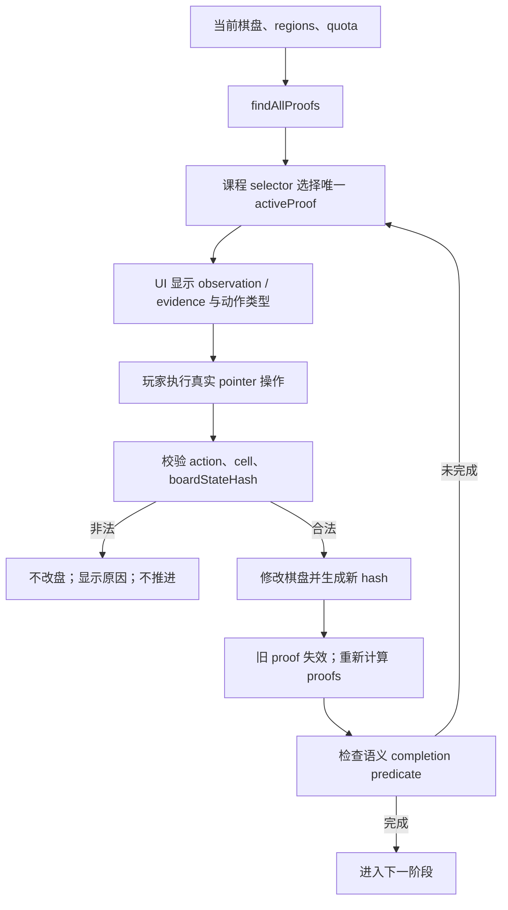

# Star Double Lv.1–10 证明驱动教学规范

## 产品目标

Lv.1–10 是一条可实际游玩、理解、完成和验证的课程。每关都要让玩家知道学什么、
观察哪里、应该标 X 还是放置星星，并亲手完成 Guided、Transfer Practice 和整关。

Lv.1 继续引用已经验收的原合同。Lv.2–9 的教学结论只来自当前棋盘、星域与双星配额；
Lv.10 不增加规则，只保留需要玩家确认的 INTRO 与 Autonomous。

## 逐关决策

| Lv | 主题 | 数据决策 | 合同决策 | 正式入口 |
|---:|---|---|---|---:|
| 1 | 双星规则与 2×2 入门 | KEEP_LAYOUT_AND_CONTRACT | 引用原合同 | 原流程 |
| 2 | 星星周围八格排除 | REGENERATE_LEVEL | proof-driven 重写 | 1 步 |
| 3 | 单位已有两星后的排除 | REGENERATE_LEVEL | proof-driven 重写 | 2 步 |
| 4 | 剩余合法格等于缺星数 | REGENERATE_LEVEL | proof-driven 重写 | 1 步 |
| 5 | 已有一星后寻找第二颗 | REGENERATE_LEVEL | strategy contract 重写 | 1 步 |
| 6 | 星域形状与局部容量 | KEEP_LAYOUT_REWRITE_CONTRACT | 新增 confined proof | 2 步 |
| 7 | 多单位交叉判断 | REGENERATE_LEVEL | 新增 intersection proof | 1 步 |
| 8 | 两依据位置的共同冲突 | KEEP_LAYOUT_REWRITE_CONTRACT | 新增 common-conflict proof | 1 步 |
| 9 | 三步传播链 | REGENERATE_LEVEL | 带前瞻的 strategy contract | 0 步 |
| 10 | 毕业挑战 | KEEP_LAYOUT_REWRITE_CONTRACT | INTRO → Autonomous | 手动确认 |

稳定 level ID、8×8 尺寸、课程顺序和进度映射不变。Lv.11–60 完全不在本课程数据
修改范围内。

## 证明与状态流

任何 proof 都必须有非空 `derivedTargets`、当前 `boardStateHash`、可独立重算的
`premises`、`observationCells` 与 `evidenceCells`。引擎不读取 `solution`、
`revealPath` 或 `canonicalPath`。

正式通用技术：

- `two-by-two-capacity`
- `adjacency-exclusion`
- `quota-saturated`
- `remaining-capacity`
- `confined-capacity`
- `multi-unit-intersection`
- `common-conflict`

Lv.9 不是第八种规则。Chain 1 和 Chain 2 只选择能在操作后新生成下一条证明的目标；
Chain 2/3 还必须与前一步受影响单位重叠，且证明 identity 在前一步操作前不存在。

## 合同与界面边界

Lv.2–9 的互动步骤使用统一 schema：`id`、`phase`、`lessonTopic`、
`proofSelector`、`allowedPrerequisiteRules`、`completionPredicate`、
`expectedAction`、观察/依据呈现、隐藏目标、错误反馈与转换条件。

- SETUP 必须由真实玩家操作和盘面条件共同完成，不能按固定动作次数跳过。
- Guided 显示观察范围与依据，不显示目标。
- Transfer Practice 更换 proof 或单位，不显示目标，但继续明确动作类型。
- proof 缺失、目标为空或哈希陈旧时禁止输入。
- Autonomous 不使用 proof bridge；基础提示延迟机制保持独立。
- Summary 只在棋盘完成后记录课程完成，不改变正式进度 schema。

放置星星使用正式双击语义：第一次 tap 进入待定，窗口内第二次 tap 取消待定 X，
最终只提交一次 `place-star`。测试也使用两次 pointer tap，不使用裸 `dblclick`。

## E2E bridge

仅当 `VITE_E2E_PROOF_BRIDGE=1` 时可用。对象及三个数组均冻结，只允许：

`levelId`、`lessonStepId`、`lessonStep`、`phase`、`technique`、
`expectedAction`、`observationCells`、`evidenceCells`、`derivedTargets`、
`boardStateHash`。

bridge 没有 setter、答案或 canonical path；production build 中属性不存在。UI、
bridge 和输入校验都读取同一个 `activeProof`。

## 生成与质量门禁

生成器 `scripts/generate-star-double-teaching-course.mjs` 使用固定 seed：

- 单关最多 4,000 attempts。
- 单关 wall-clock 最多 10 分钟。
- 每个有效候选即时 checkpoint，支持 `--resume`。
- 只接受第一个完整通过课程模拟的候选。
- 候选从不同正式 8×8 母版收缩星域，保留多样推理结构。

每个候选必须通过连通、声明解合法、唯一解、人类逻辑、trace 回放、截至该课的规则
白名单、exact/D4 region、normalized reasoning fingerprint、exact trace、相邻
region ≤ 0.50、相邻 trace ≤ 0.78、教学 trace < 0.95 和完整课程模拟。

最终主题入口动作数为：

`Lv.2=1, Lv.3=2, Lv.4=1, Lv.5=1, Lv.6=2, Lv.7=1, Lv.8=1`。

Lv.9 的三步 board hash 在固定模拟中为不同值；E2E 还会重新确认三次真实 UI 操作后
才进入 Autonomous。

## 人工验收

1. 如只需重新看教学，在设置中选择已完成的 Lv.1–10 课程并点击“重新查看所选课程”。
2. 如需清除教学记录，在控制台执行：
   `localStorage.removeItem('cg_star_line_double_guidance_v1')`
3. 从 Lv.1 开始依次进入 Lv.10；不要清除 `cg_star_line_progress_v2`。
4. 每关确认主题、观察依据、动作说明、非法操作反馈、Transfer 不泄露目标和最终胜利。
5. Lv.9 特别确认每步完成后观察范围与动作类型都发生真实变化。
6. Lv.10 等待数秒确认 INTRO 不会自动跳过，再点击“开始挑战”独立完成。
